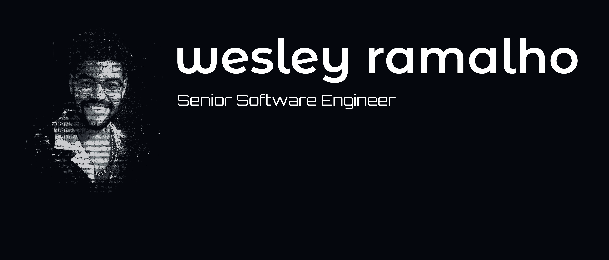

## Hi, I'm Wesley! 👨🏽‍💻

### Senior Software Engineer | AI Specialist & Frontend

I'm a full-stack engineer with deep front-end expertise and 9+ years of production experience. I specialize in building high-performance web applications with JavaScript, TypeScript, React, and Next.js. I've worked on platforms serving 12M+ and 18M+ unique monthly visitors, delivered projects for Disney and Mattel, and contributed to teams at Zappos (Amazon) and Itaú bank. I'm currently pursuing a Postgraduate degree in Artificial Intelligence & Machine Learning, expanding my expertise beyond front-end into AI-powered products.

  

## About me:

> 🇧🇷 Brazilian

> 📌 Based in **São Paulo**, **Brazil**

> 💼 Currently Senior Software Engineer at **Tecla (CredoAI)** — Remote, United States

> 🎓 Postgraduate in **Artificial Intelligence & Machine Learning** — PUC Minas (2025–2026)

> 🤖 AI Specialist + Frontend focus

> 🌐 Personal website at <a href="https://wesleyramalho.com" alt="Personal website" target="blank">wesleyramalho.com</a>

> 👔 <a href="https://br.linkedin.com/in/wesley-ramalho-245bb5b1" alt="Linkedin link" target="blank">LinkedIn</a>

## Experience highlights:

- **Tecla (CredoAI)** — Senior Software Engineer, Apr 2025–Present
- **Truelogic / Zappos (Amazon)** — Senior Software Engineer, Oct 2024–Jul 2025 · Led Marty initiative for 18M+ monthly visitors.
- **Tecla (OnChain Studios)** — Senior Front-end Engineer, Oct 2023–Jun 2024 · Disney & Mattel pages, NFT/Amazon API integration
- **X-Team** — Senior Front-end Engineer, Sep 2021–Sep 2023 · Remote, Australia
- **iCarros (Itaú)** — Front-end Developer, Mar 2020–May 2021 · 12M+ unique monthly accesses, micro front-end architecture

## My skills:

**Frontend:** JavaScript, TypeScript, React, Next.js, Tailwind CSS, HTML, CSS, GSAP, Storybook

**Backend:** Node.js, Express, REST APIs, AWS Lambda

**AI/ML:** AI integrations, currently studying (PUC Minas postgraduate)

**Testing:** Jest, Cypress, Testing Library

**Tools:** Docker, Git, Agile, Figma / UX–UI processes
